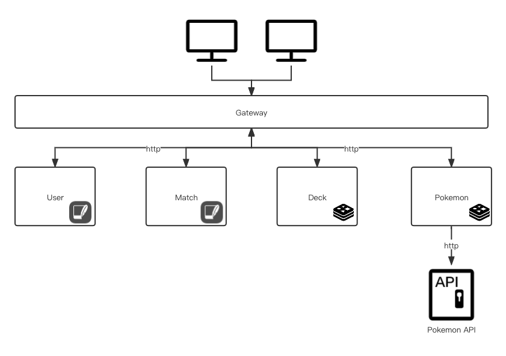

# 1. Architecture

This project is composed of 4 different services. 

# 2. Technical choice

This partition of services follows to main basic principles:

1. KISS (Keep It Simple and Stupid)

   I tried my best to minimize the number of services to avoid a complex situation. For persistance layer, I chose SQLite since it is very easy to manipulate and not diffcuilt at all to use by code. As for the Pokemon service, unnecessary inforamtion from Pokmon API is discarded to make it easier in this project. And a Pokemon model is created for these data. 

2. High cohesion and low coupling

   I managed to make elements belong togher in the same service to avoid redundant http request between containers. The developement is also simplified in this way.

The purpose of Pokemon service is mainly to avoid http request by a cache in the memory. I used a `Map` to store all pokmons that we have already enquired and no need to send another request for the data we already have. 

# 3. Endpoint List

The base URL is `http://0.0.0.0:80/api`

## 3.1 User Service

You need to **log in at first** to access service.

| Method | URL                              | Function              | Example body                                                 | Example response                                             |
| ------ | -------------------------------- | --------------------- | ------------------------------------------------------------ | ------------------------------------------------------------ |
| GET    | `http://0.0.0.0:80/api/user`     | Get the list of users |                                                              | [{"user_id":1,"login_id":"testLoginId3","passwd":"testPassWd","name":"testName","score":0}] |
| PUT    | `http://0.0.0.0:80/api/user`     | Create a new user     | {"name":"testName","loginId":"testLoginId3","passwd":"testPassWd"} |                                                              |
| GET    | `http://0.0.0.0:80/api/user/:id` | Get the user by id    |                                                              | {"user_id":1,"login_id":"testLoginId3","passwd":"testPassWd","name":"testName","score":0} |
| POST   | `http://0.0.0.0:80/api/auth`     | Log in                | {"loginId":"testLoginId3","passwd":"testPassWd"}             |                                                              |

## 3.2 Pokemon Service

| Method | URL                                        | Function                              | Example body                               | Example response                                             |
| ------ | ------------------------------------------ | ------------------------------------- | ------------------------------------------ | ------------------------------------------------------------ |
| GET    | `http://0.0.0.0:80/api/pokemons`           | Get the list of pokemons              |                                            | {"count":1118,"next":"https://pokeapi.co/api/v2/pokemon/?offset=20&limit=20","previous":null,"results":[{"name":"bulbasaur","url":"https://pokeapi.co/api/v2/pokemon/1/"},{"name":"ivysaur","url":"https://pokeapi.co/api/v2/pokemon/2/"}]} |
| GET    | `http://0.0.0.0:80/api/pokemons/:page`     | Get the specific page of pokemons     | `http://0.0.0.0:80/api/pokemons/2`         | {"count":1118,"next":"https://pokeapi.co/api/v2/pokemon/?offset=40&limit=20","previous":"https://pokeapi.co/api/v2/pokemon/?offset=0&limit=20","results":[{"name":"spearow","url":"https://pokeapi.co/api/v2/pokemon/21/"},{"name":"fearow","url":"https://pokeapi.co/api/v2/pokemon/22/"},{"name":"ekans","url":"https://pokeapi.co/api/v2/pokemon/23/"},{"name":"arbok","url":"https://pokeapi.co/api/v2/pokemon/24/"},{"name":"pikachu","url":"https://pokeapi.co/api/v2/pokemon/25/"},{"name":"raichu","url":"https://pokeapi.co/api/v2/pokemon/26/"},{"name":"sandshrew","url":"https://pokeapi.co/api/v2/pokemon/27/"},{"name":"sandslash","url":"https://pokeapi.co/api/v2/pokemon/28/"},{"name":"nidoran-f","url":"https://pokeapi.co/api/v2/pokemon/29/"},{"name":"nidorina","url":"https://pokeapi.co/api/v2/pokemon/30/"},{"name":"nidoqueen","url":"https://pokeapi.co/api/v2/pokemon/31/"},{"name":"nidoran-m","url":"https://pokeapi.co/api/v2/pokemon/32/"},{"name":"nidorino","url":"https://pokeapi.co/api/v2/pokemon/33/"},{"name":"nidoking","url":"https://pokeapi.co/api/v2/pokemon/34/"},{"name":"clefairy","url":"https://pokeapi.co/api/v2/pokemon/35/"},{"name":"clefable","url":"https://pokeapi.co/api/v2/pokemon/36/"},{"name":"vulpix","url":"https://pokeapi.co/api/v2/pokemon/37/"},{"name":"ninetales","url":"https://pokeapi.co/api/v2/pokemon/38/"},{"name":"jigglypuff","url":"https://pokeapi.co/api/v2/pokemon/39/"},{"name":"wigglytuff","url":"https://pokeapi.co/api/v2/pokemon/40/"}]} |
| GET    | `http://0.0.0.0:80/api/pokemon/:name`      | Get the detail of a pokemon by name   | `http://0.0.0.0:80/api/pokemon/spearow`    | {"id":21,"name":"spearow","type":["normal","flying"],"url":"https://pokeapi.co/api/v2/21/"} |
| GET    | `http://0.0.0.0:80/api/pokemon/type/:type` | Get the detail of a type by type name | `http://0.0.0.0:80/api/pokemon/type/grass` | {"name":"grass","doubleDamageFrom":[{"name":"flying","url":"https://pokeapi.co/api/v2/type/3/"},{"name":"poison","url":"https://pokeapi.co/api/v2/type/4/"},{"name":"bug","url":"https://pokeapi.co/api/v2/type/7/"},{"name":"fire","url":"https://pokeapi.co/api/v2/type/10/"},{"name":"ice","url":"https://pokeapi.co/api/v2/type/15/"}],"doubleDamageTo":[{"name":"ground","url":"https://pokeapi.co/api/v2/type/5/"},{"name":"rock","url":"https://pokeapi.co/api/v2/type/6/"},{"name":"water","url":"https://pokeapi.co/api/v2/type/11/"}]} |

## 3.3 Match Service

| Method | URL                                    | Function                                                     | Example body                                                 | Example response                                             |
| ------ | -------------------------------------- | ------------------------------------------------------------ | ------------------------------------------------------------ | ------------------------------------------------------------ |
| GET    | `http://0.0.0.0:80/api/match`          | Get the lis of all matchs                                    |                                                              | [{"id":1,"player1":1,"player2":null,"pokemons_player1":null,"pokemons_player2":null,"round_winner_id":null,"status":"created","winner":null,"pokemonsPlayer1":null,"pokemonsPlayer2":null,"roundWinnerId":null}] |
| PUT    | `http://0.0.0.0:80/api/match`          | Create a new match                                           | {"idPlayer1":1}                                              | 1 (the id of the match)                                      |
| POST   | `http://0.0.0.0:80/api/match`          | Update a match                                               | {"id":1,"idPlayer1":1,"idPlayer2":2,"roundWinnerId":[],"pokemonsPlayer1":["bulbasaur"],"pokemonsPlayer2":["ivysaur"],"status":"created","winner":null} |                                                              |
| POST   | `http://0.0.0.0:80/api/match/newround` | Start a new round with selected pokemon.  Return value is  match with updated information. If after this round, the game is over, than athe winner will be automatically calculated. In the case that two players have the same points, the id of winner is -1 | {"match":{"id":1,"idPlayer1":1,"idlayer2":2,"roundWinnerId":[],"pokemonsPlayer1":["bulbasaur"],"pokemonsPlayer2":["ivysaur"],"status":"created","winner":null},"pokemon1":{"id":1,"name":"bulbasaur","type":["grass","poison"],"url":"https://pokeapi.co/api/v2/1/"},"pokemon2":{"id":2,"name":"ivysaur","type":["grass","poison"],"url":"https://pokeapi.co/api/v2/2/"}} | {"winner":"","match":{"id":1,"idPlayer1":1,"idlayer2":2,"roundWinnerId":[-1],"pokemonsPlayer1":[],"pokemonsPlayer2":[],"status":"finished","winner":-1}} |
