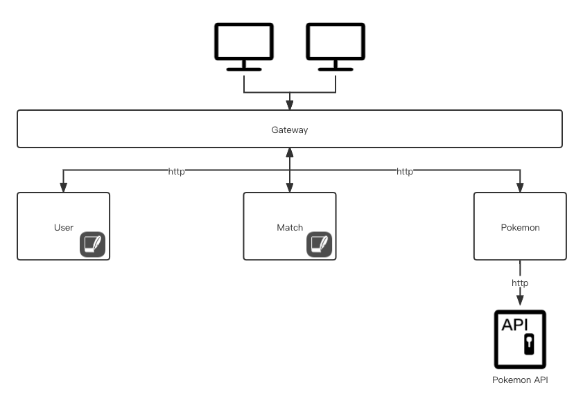

# 1. Architecture

This project is composed of 5 different services. 

# 2. Function of Services

This project is composed of 5 different services who are divided based on data model and functionality. 

## 2.1 Gateway Service

The service works as a dispatcher. It exposes uniform interfaces to access the services. It has **no connection with data**.

## 2.2 User Service

The service focuses on users' data and offers all necessary manipulations.

Functions:

1. Register: create a new user and save it in database

2. Login: authenticate an user

## 2.3 Pokemon Service

The data of pokemen is the main concern of this service. It works basically as a cache server to avoid frequent request to the remoete Pokemon API.

Functions:

1. Get: get the data of a pokemon corresponding a name or an ID

## 2.4 Deck Service

The service helps to maintain the status of an user's deck in a match.

Functions:

1. Create: create a deck from the chosen Pokemons
2. Set status: update the status of a specific pokemon in a deck

3. Get: get all pokemon and corresponding status

## 2.5 Match Service

This service is the core service to manage matches.

Functions:

1. Create: create a match
2. Join: join a match and the match
3. Ready: ready for the start of match
4. Choose a deck: select Pokemons to compose a deck
5. Choose a Pokemon: choose a Pokemon from the deck
6. Calculate the result: calculate the result of a round
7. Get: get match history

# TODO LIST
1. 每回合胜负计算
2. 数据统计
3. 选取小精灵